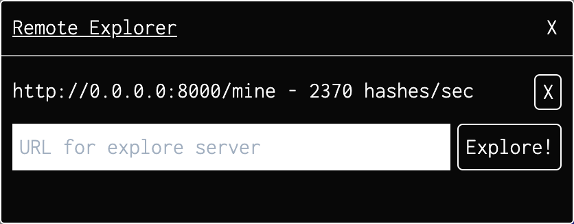

# df-plugins

In v0.5 of [Dark Forest](https://zkga.me/), they added the ability to customize the game through "Plugins". These are scripts that are run by the game and provided access to specific aspects of the game.

__WARNING:__ Plugins are evaluated in the context of your game and can access all of your private information (including private key!). You should not use any plugins that you haven't written yourself and control the entire pipeline (such as imported dependencies). Plugins can dynamically load data, which can be switched out from under you!!!

## Examples

This repository contains plugins used by myself and [@jacobrosenthal](https://github.com/jacobrosenthal) in our DF games. It is only recommended as a reference guide on making plugins. __You should not use these verbatim and should control the entire pipeline!__

## Plugins

### RemoteExplorePlugin

The remote explore plugin allows us to use headless explorers that we run on servers and RaspberryPi devices.

We use [mimc-fast](https://github.com/jacobrosenthal/mimc-fast) as a webserver that exposes a `/mine` endpoint and connect to it from in-game with this plugin.

When running this on https://zkga.me/, you might get an error about blocked insecure content. You probably just want to install a SSL Certificate on your explore server. If you can't, you can [enable mixed content](enable-mixed.md), __but this is extremely dangerous.__
