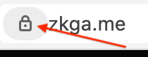
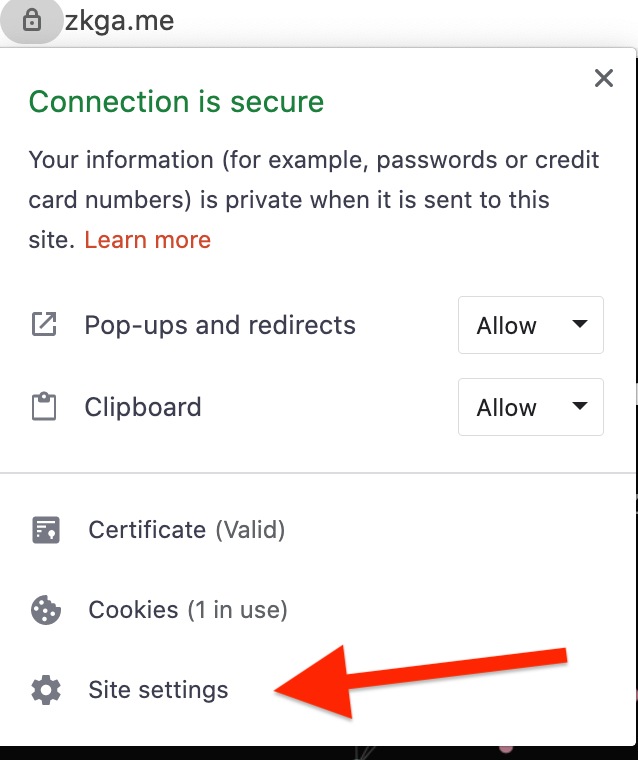
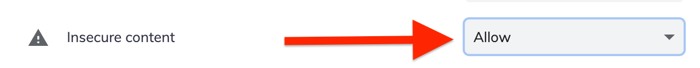
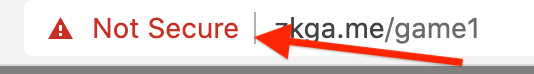

# Enable mixed content

If you are willing to accept the risks of dangerous mixed content, you can enabled it for https://zkga.me/.

__WARNING:__ Don't do this!!!

1. Click the secure lock in your browser.

   

2. Select "Site Settings" in the menu.

   

3. Find "Insecure content" and set it to "Allow".

   

4. You'll have to refresh the page and then you will see this in the url bar.

   

